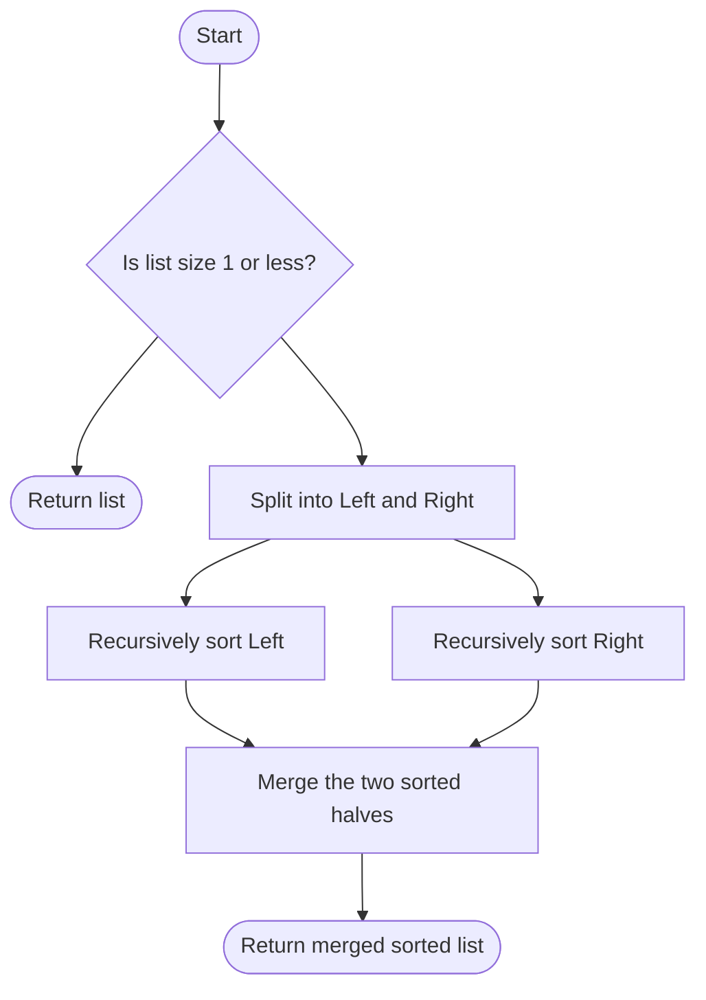
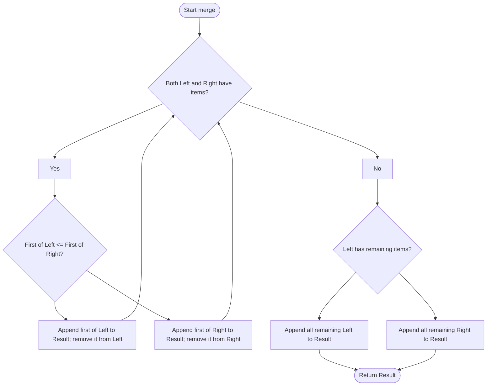

**Merge Sort - How It Works**
**Overview:** Merge sort uses "divide and conquer" to sort an array efficiently.

**Step 1: Splitting (merge Sort function)**
1. Find the middle index: `mid = Math.floor(arr.length / 2)`
2. Split array into two halves:
    - `left = arr.slice(0, mid)`
    - `right = arr.slice(mid)`
3. Base case: If array has 1 element, return it (already sorted)


**Step 2: Recursion**

```javascript
return merge(mergeSort(left), mergeSort(right));
```

**Key insight:** `mergeSort(left)` runs completely FIRST (splits all the way down to single elements, merges back up), THEN `mergeSort(right)` runs, and ONLY THEN does the final merge happen.

**Example with [5, 2, 8, 1]:**
- `mergeSort([5, 2])` → splits to [5], [2] → merges to [2, 5] ✓
- `mergeSort([8, 1])` → splits to [8], [1] → merges to [1, 8] ✓
- `merge([2, 5], [1, 8])` → final result: [1, 2, 5, 8] ✓


**Step 3: Merging (merge function)**

**Input:** Two SORTED arrays (left and right)
**Process:**
1. Create empty result array
2. Use two pointers: `i = 0` (for left), `j = 0` (for right)
3. While both arrays have elements:
    - Compare `left[i]` vs `right[j]`
    - Push the smaller value to result
    - Move that pointer forward
4. Push any remaining elements from left or right array
5. Return the sorted result array

**Why It Works:**

- Single elements are already sorted (base case)
- Merging two sorted arrays always produces a sorted array
- We build up from small sorted pieces to the final sorted array

**Time Complexity:** O(n log n)
- log n = number of times we split the array in half
- n = total comparisons at each level when merging
Space Complexity: O(n)

Merge Sort Code:
```JavaScript
function mergeSort(arr) {
  // Base case: if array has 1 or 0 elements, it's already sorted
  if (arr.length <= 1) {
    return arr;
  }
  // Find the middle index of the array
  const mid = Math.floor(arr.length / 2);
  
  // Split array into left half (from start to middle)
  const left = arr.slice(0, mid);
  
  // Split array into right half (from middle to end)
  const right = arr.slice(mid);
  
  // Recursively sort both halves and merge them
  return merge(mergeSort(left), mergeSort(right));
}

function merge(left, right) {
  const result = []; // Array to store merged result
  let i = 0; // Index for left array
  let j = 0; // Index for right array
  
  // Compare elements from left and right arrays
  while (i < left.length && j < right.length) {
    if (left[i] < right[j]) {
      result.push(left[i]); // Add smaller element from left
      i++; // Move left pointer forward
    } else {
      result.push(right[j]); // Add smaller element from right
      j++; // Move right pointer forward
    }
  }
  
  // Add remaining elements from left array (if any)
  while (i < left.length) {
    result.push(left[i]);
    i++;
  }
  
  // Add remaining elements from right array (if any)
  while (j < right.length) {
    result.push(right[j]);
    j++;
  }
  
  return result; // Return merged sorted array
}

// Example usage:
const unsorted = [38, 27, 43, 3, 9, 82, 10];
const sorted = mergeSort(unsorted);
console.log(sorted); // [3, 9, 10, 27, 38, 43, 82]
```


Example how divide and sorting works in Merge sort?
```JavaScript
				[38, 27, 43, 3]
                      |
            +---------+---------+
            |                   |
        [38, 27]              [43, 3]
            |                   |
        +---+---+           +---+---+
        |       |           |       |
      [38]    [27]        [43]     [3]
        |       |           |       |
        +---+---+           +---+---+
            |                   |
        [27, 38]              [3, 43]
            |                   |
            +---------+---------+
                      |
                [3, 27, 38, 43]
```

How Does Recursive Calls works?
```JavaScript
Call 1:  mergeSort([38, 27, 43, 3])  ← starts here, but CAN'T finish yet
           ↓ needs mergeSort([38, 27]) first...
           
Call 2:    mergeSort([38, 27])  ← goes here, but CAN'T finish yet
             ↓ needs mergeSort([38]) first...
             
Call 3:      mergeSort([38])  ← length is 1, RETURNS [38] immediately ✓
             
Call 2:    mergeSort([38, 27])  ← now needs mergeSort([27])
             ↓
             
Call 4:      mergeSort([27])  ← length is 1, RETURNS [27] immediately ✓

Call 2:    mergeSort([38, 27])  ← NOW it can merge([38], [27])
           ↓ merge happens → RETURNS [27, 38] ✓
           
Call 1:  mergeSort([38, 27, 43, 3])  ← still waiting! Now needs mergeSort([43, 3])
           ↓
           
Call 5:    mergeSort([43, 3])  ← same process repeats...
```

How Recursion Works?
```JavaScript
Step 1: mergeSort([38, 27, 43, 3]) starts
        ↓
        left = [38, 27]
        right = [43, 3]
        ↓
        Now we hit: return merge(mergeSort(left), mergeSort(right))
        
Step 2: JavaScript says "Wait! I need mergeSort([38, 27]) first!"
        So it PAUSES and goes into mergeSort([38, 27])
        ↓
        This splits into [38] and [27]
        ↓
        mergeSort([38]) → returns [38]
        mergeSort([27]) → returns [27]
        ↓
        merge([38], [27]) → returns [27, 38] ✓
        
Step 3: NOW mergeSort([38, 27]) is done! It returned [27, 38]
        JavaScript says "Okay, now I need mergeSort([43, 3])"
        ↓
        This splits into [43] and [3]
        ↓
        mergeSort([43]) → returns [43]
        mergeSort([3]) → returns [3]
        ↓
        merge([43], [3]) → returns [3, 43] ✓
        
Step 4: NOW both are done!
        merge([27, 38], [3, 43]) → returns [3, 27, 38, 43] ✓
```


How does Merge happens to sort the array?
```JavaScript
merge([27, 38], [3, 43])

left = [27, 38]     right = [3, 43]
       ↑                   ↑
       i=0                 j=0

Step 1: Compare 27 vs 3
        3 is smaller → result = [3], j moves to 1

left = [27, 38]     right = [3, 43]
       ↑                       ↑
       i=0                     j=1

Step 2: Compare 27 vs 43
        27 is smaller → result = [3, 27], i moves to 1

left = [27, 38]     right = [3, 43]
           ↑                   ↑
           i=1                 j=1

Step 3: Compare 38 vs 43
        38 is smaller → result = [3, 27, 38], i moves to 2

left = [27, 38]     right = [3, 43]
           (done)              ↑
                               j=1

Step 4: left is done, add remaining from right
        → result = [3, 27, 38, 43] ✓
```

How sorting works for 38,27?
```JavaScript
merge([38], [27])

left = [38]    right = [27]
i = 0          j = 0
result = []  ← yes, we create a new array!

Step 1: Compare left[0] vs right[0]
        38 vs 27
        27 is smaller!
        result.push(right[j]) → result = [27]
        j++ → j = 1
        
Step 2: Now j = 1, but right.length = 1
        So the while loop stops (j < right.length is false)
        
Step 3: What about the 38? It's still in left array!
        We use the second while loop:
        while (i < left.length) {
          result.push(left[i]) → result = [27, 38]
          i++
        }
        
Final: return [27, 38] ✓
```


Sorting and merging the divided elements?
```JavaScript
what happens step-by-step:
mergeSort([38, 27])
  ↓ splits into
  mergeSort([38]) and mergeSort([27])
  ↓ both return immediately (base case: length 1 is already sorted!)
  [38] ← sorted!    [27] ← sorted!
  ↓
  merge([38], [27])  ← we're merging TWO SORTED arrays!
  ↓
  returns [27, 38]  ← sorted!
```

```JavaScript
when we go back up:
mergeSort([38, 27, 43, 3])
  ↓
  mergeSort([38, 27])  →  returns [27, 38] ← SORTED!
  mergeSort([43, 3])   →  returns [3, 43]  ← SORTED!
  ↓
  merge([27, 38], [3, 43])  ← AGAIN, two sorted arrays!
  ↓
  returns [3, 27, 38, 43]  ← final sorted array!
```

What is the base condition? How Does it break?
```JavaScript
mergeSort([5, 2])
  ↓
  arr.length = 2, so (arr.length <= 1) is FALSE
  → Continue splitting
  
  mid = 1
  left = [5]
  right = [2]
  
  ↓ Now call mergeSort([5])
  
mergeSort([5])
  ↓
  arr.length = 1, so (arr.length <= 1) is TRUE ← BASE CONDITION HIT!
  → return [5] immediately (no more splitting!)
  
  ↓ Back to mergeSort([5, 2]), now call mergeSort([2])
  
mergeSort([2])
  ↓
  arr.length = 1, so (arr.length <= 1) is TRUE ← BASE CONDITION HIT!
  → return [2] immediately (no more splitting!)
  
  ↓ Back to mergeSort([5, 2])
  Now we have both results: [5] and [2]
  → merge([5], [2]) → returns [2, 5]
```

Summarize what you now understand:
**1. The Recursion Pattern:**
- Split all the way down to single elements FIRST (left side completely, then right side)
- THEN merge on the way back up
- Each merge receives TWO SORTED arrays (guaranteed by recursion below)

**2. The Two-Pointer Merge:**
- Compare front elements: `left[i]` vs `right[j]`
- Take the smaller one, move that pointer forward
- When one array runs out, add all remaining from the other array

**3. Why it works:**
- Single elements are already sorted (base case)
- Merging two sorted arrays always produces a sorted array
- Build up from small sorted pieces to the final sorted array

Merge sort flow (whole algorithm)





- **Where can I use merge sort?**    
    - When you need **stable sorting** (keep equal items’ original order).
    - For **linked lists** (easy splits, O(1) extra per node).
    - For **very large data / external sort** (data on disk; merge chunks).
    - When worst-case guarantees matter: **O(n log n)** time always.

- **Do I have to use the exact same code (recursion + 2-pointer merge)?**    
    - The **2-pointer merge** is the core idea—yes, that pattern stays.
    - Recursion is common but **not required**: you can do **iterative (bottom-up)** merge sort.
    - Variants exist (e.g., merge by key, descending, custom comparators).
    - True **in-place merge** is tricky; standard merge sort uses **O(n) extra space**.

- **Real-life examples**?
    - **Merging sorted logs** from multiple servers by timestamp.
    - **Combining sorted CSVs** (e.g., sales by date) into one sorted file.
    - **Search engines**: merging sorted posting lists.
    - **Big data pipelines**: external merge sort for datasets larger than RAM.


- **If the input has only 2 elements**?
    - Just **compare & swap**. That’s it.
```js
	const a = [x, y];
	if (a[0] > a[1]) [a[0], a[1]] = [a[1], a[0]];
```

- In merge sort, this is naturally handled by the base case + one merge step.

- **If it’s a 2D / multi-dimensional array**? 
    - First decide **what “sorted” means**:
        - **Sort each row** individually → apply merge sort per row.
        - **Sort rows by a column/key** (e.g., by col 2) → treat each row as one item; compare `row[i]`.
        - **Global sort of all cells** → flatten → sort → reshape.
        - **Lexicographic row order** → compare row arrays element-by-element.

    - Mini patterns:        
        - **Sort rows by column `k`:**
            ```js
			// assuming mergeSort can take a comparator cmp(a,b)
			const cmp = (r1, r2) => r1[k] - r2[k];
			const sortedRows = mergeSort(rows, cmp);
```
            
        - **Sort each row:**
            ```js
            const sorted = rows.map(r => mergeSort(r));
            ```
            
        - **Global sort (all elements):**
            ```js
            const flat = rows.flat();
            const sortedFlat = mergeSort(flat);
            // reshape if needed
            ```