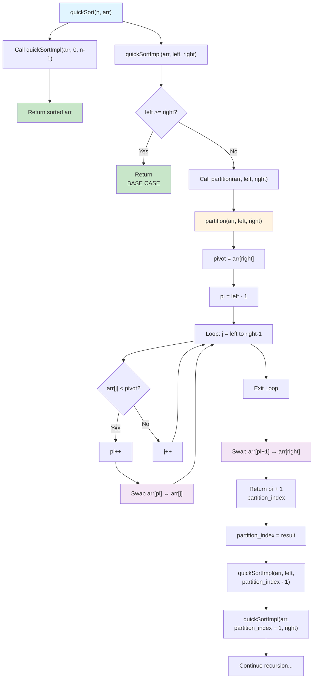

Code:
```javaScript
//According to Classes i have learned. better for interviews.
//IN - PLACE QUICKSORT(Interview standard)
// Sorts the array directly, more memory efficient
function partition(arr, left, right) {
    let pivot = arr[right];
    let pi = left - 1;
    for (let j = left; j <= right - 1; j++) {
        if (arr[j] < pivot) {
            pi++;
            // Swap arr[pi] & arr[j]
            let tmp = arr[pi];
            arr[pi] = arr[j];
            arr[j] = tmp;
        }
    }

    //Swap arr[pi + 1] & arr[right]
    let tmp = arr[pi + 1];
    arr[pi + 1] = arr[right];
    arr[right] = tmp;
    return pi + 1;
} 

function quickSortImpl(arr, left, right) {
    if (left >= right) {
        return;
    }
    
    let partition_index = partition(arr, left, right);
    quickSortImpl(arr, left, partition_index - 1);
    quickSortImpl(arr, partition_index + 1, right);
}

function quickSort(n, arr) {
    // implement this function
    quickSortImpl(arr, 0, n - 1);
    return arr;
}

console.log(quickSort(5, [7, 4, 3, 9, 10]));
```


- The heart of the code is partition.
- While understanding the code, start understanding the partition.

#### So what happens in Partition?

In Partition function we need to find pivot index location(the location should be same as when the array is sorted).

Need to swap the elements based on pivot value. what this means means is given below:

How partition is done?
- We need to take a pivot value and the value should be:
		pivot = arr[ right ] 
	why pivot instead of directly taking arr[ right ]?
	Because - we are modifying the same input array by swapping, so we need to take pivot because arr[ right ] may change it's value after swapping.
- Now we need to take partial_index(pi). why?
	because we need to set the pivot value to it's location(i.e index value, we return pi+1)
- Now loop left to right-1.
- if arr[j] < pivot then swap arr[pi] & arr[j]


---
#### Mermaid Chart:
[Edit in Mermaid Chart Playground](https://mermaidchart.com/play?utm_source=mermaid_mcp_server&utm_medium=remote_server&utm_campaign=claude#pako:eNqNk9tu00AQhl9lZCRUlDjUqoIgqEHNoU3aNG3iFAnVEQrOLt2weIO9pkVNb3kCnpAnYXY2WbuBVPjCF_6_-efoey9Wc-Y1PC7VbXwzSzVMOlEC-BxdR963XMRfQpXqvaQKszR9EXlT8P0mtFBsz6QER_S_LuUeIlXYr0LiBwa1Ri2KaGPEmOk8TSBDnM2Nn2PWKYnslBMXtpJxXYVUfL7RhXeHIrr3kWdkaB5a4F3kPViga4DVB5at4NhV8Fzqt5_Sl83WUdiFNr6cn8WHagUnmw6XOBShhUqeKMO-T6iYHgb-T0yP6L6hxXel4dAM5JqgqYP6BJ0ShAQ16UPg9FPSz1AfKLVswGIDaWXz-QV7RuwAZ2USLaZgxgCUvJjXoJjXOWWtVJzBORkM8XN4O1tSuUsxhd8_f4F1dOTQllW2NDO9wNBFyfCijNnyLhHp3gkNph8HXpI2epy5EhS5t8Y2In5cnBxOrwLBZu9uPR9FMmd3W2scU3BYXqPlcLYpy3KpXUBI6OSJg92R0iyxOIUJ2Vz902aXAbbz10ldkc97c7kq0SLJGRYc52mGYbVabavPTP-QDP85LqRsPGMBr3NeVo7XSvyavYrflJXeWuGcH7D9sjLcKAeszutlZbRTaT_K4z38AR9KYmM)


