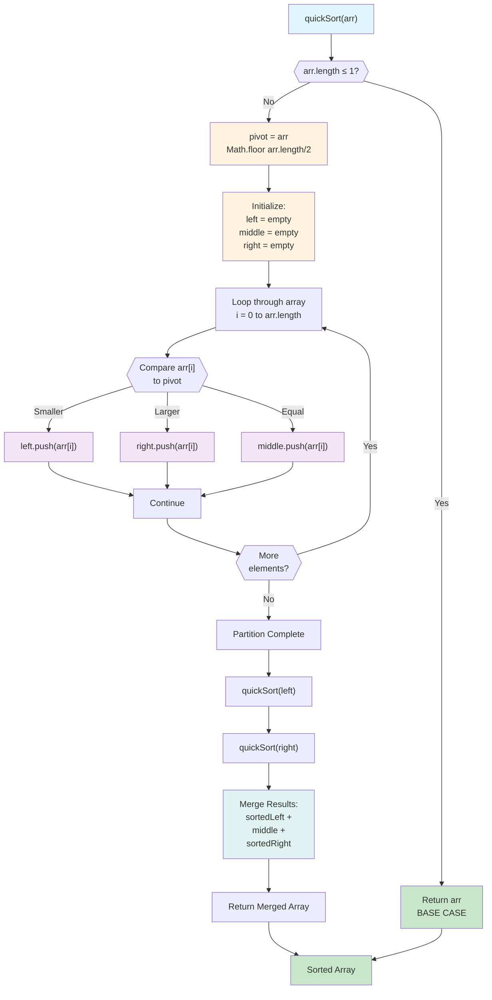

#### The Core Idea
Think back to merge sort for a second. In merge sort, we:
1. **Divide** the array in half (easy part)
2. Recursively sort both halves
3. **Merge** them back together (hard part - requires extra space)

Quick Sort flips this around:
1. **Partition** the array around a pivot (hard part - but done in-place!)
2. Recursively sort both sides
3. **Combine** - wait, there's no combining step! Everything is already in place.


 Example: how 7 recursive calls happens in tree format:  (Each box in the tree except the original array represents one recursive call)

```text
                    [64, 34, 25, 12, 22]  pivot=25
                    /          |          \
            [12, 22]         [25]        [64, 34]
            pivot=12          |           pivot=64
            /  |  \                       /  |  \
          []  [12] [22]               [34] [64] []
```

---
#### The Role of the Pivot in Quicksort
In the Quicksort algorithm, the "pivot" is a single element chosen from the array you are trying to sort.

The entire purpose of the pivot is to be used as a reference point to divide (or "partition") the main array into two smaller sub-arrays:
1. **Left Sub-array:** All elements that are _less than_ the pivot.
2. **Right Sub-array:** All elements that are _greater than_ the pivot.

After this partitioning step, the pivot itself is placed in its final, correct, sorted position, sitting between the "less than" and "greater than" sub-arrays.
The Quicksort algorithm then repeats this exact same process (choosing a pivot and partitioning) recursively on the two smaller sub-arrays until the entire array is sorted.
##### How is the pivot chosen?
There are several common strategies for picking the pivot:
- **First Element:** Simply pick the first element of the array. (Easiest to implement, but can be inefficient if the array is already sorted).
- **Last Element:** Pick the last element. (Very common).
- **Middle Element:** Pick the element in the middle of the array.
- **Random Element:** Pick a random element. (Often a good, safe choice to avoid worst-case scenarios).

---

Quick Sort Code: According to Claude:

```JavaScript
// According to ChatGPT and Claude
// Creates new arrays, uses extra memory
function quickSort(arr) {
    // Base case: arrays with 0 or 1 element are already sorted
    if (arr.length <= 1) {
        return arr;
    }
    // Choose the middle element as pivot
    const pivot = arr[Math.floor(arr.length / 2)];
    // Divide array into three parts
    const left = [];   // Elements smaller than pivot
    const middle = []; // Elements equal to pivot
    const right = [];  // Elements larger than pivot
    for (let i = 0; i < arr.length; i++) {
        if (arr[i] < pivot) {
            left.push(arr[i]);
        } else if (arr[i] > pivot) {
            right.push(arr[i]);
        } else {
            middle.push(arr[i]);
        }
    }
    // Recursively sort left and right, then combine
    return [...quickSort(left), ...middle, ...quickSort(right)];
}

// Test it out
const numbers = [64, 34, 25, 12, 22, 11, 90];
console.log("Original:", numbers);
console.log("Sorted:", quickSort(numbers));
```


---
#### Mermaid Diagram:
[Edit in Mermaid Chart Playground](https://mermaidchart.com/play?utm_source=mermaid_mcp_server&utm_medium=remote_server&utm_campaign=claude#pako:eNp9U91u2jAUfhUrk6ZWVSm0otqY1omfUKCBUtjNBL3IkmNizYmp42zqgAfYe_TJ-iQ7dppgojEuLNnfz_nOyWHjBCIEp-VQLn4FkS8V-dpbJgR_7cXSecpY8GMupDrxpTxdOo_k_PyGdDabpYMPNQ7JSkXk9c8LaXxZOrtdruxo1vYbpFvSRZMZqEwmBAXvufr0XV7cdNpzl3TxQEdbMhFb0kPFmv0Uiny2JWNfRTUMKSTZV764LA3ys2fyuWgxTJhiPme_oVVYcKDaFOK1ei7eYhaGHKqvkq2iklop4ZoSfSzhCbEmKpIiW0U6lF_qGWrrRAkraunSN_pbPcKuiNe-BM1asMdCjDLT_36e-XlrRjSPfc5BbskAE-iOaussjU5yi9OySk72fLnS3CFyTU__I7tPmc-3ZITcfCr_JufnwHRxt9BNJIolGZSEYQ7ll5F9uTMXT7c-FhKKhoFDDIlKrQ3y9hvUt1_0goyx6BQXFb-vSIieIQcFlXxjU2pysMJ6Wvs-JoZxf8AwM6q2em-IUySOAcdJZpBmXKXlWqWohNDTy3VWWauzQ85M25fuU-P7sP-DGPuQtPUmVTI8GO4MuXPjVCF1c9hWpOoZA7QJZZy33kGDNim1ke4bEnyA6-CjjfTeEErpFdRtxD2KDArkCpq0aSPDo8joKDItUtfpJW3YyOwgtbP7C3-ZdLQ)




